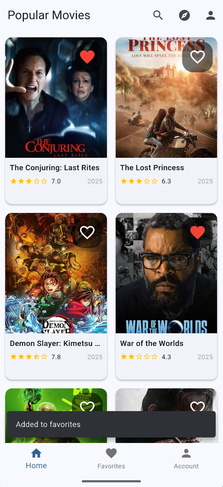
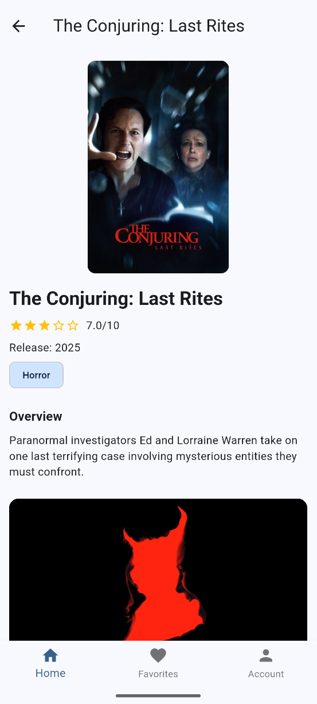
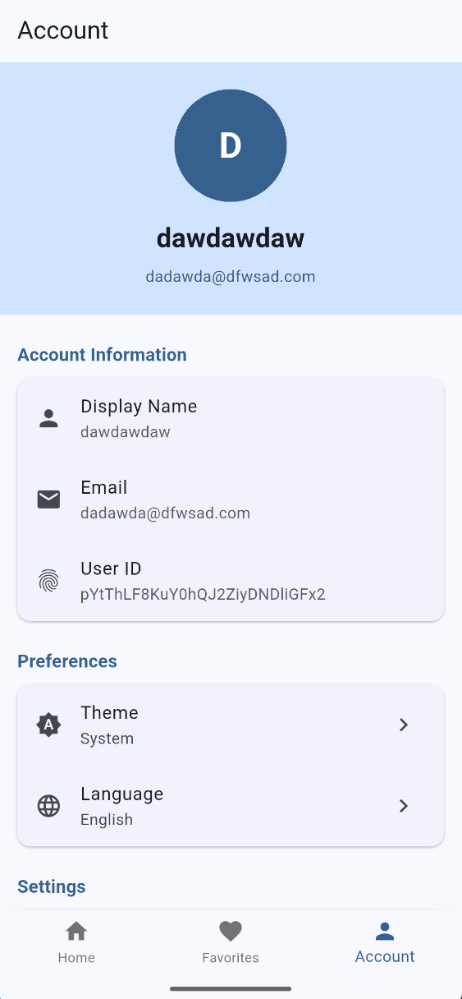

# Movie Discovery App


## 🎯 Обрана тема

Movie Discovery

## 🏗️ Архітектура

- Clean Architecture (3 layers)
- Riverpod for state management (`flutter_riverpod`)
- Repository Pattern + DI (`get_it`)

Директорії: `lib/core/`, `lib/features/`, `lib/shared/`, локалізація в `lib/l10n/`.

## 🌐 API Integration

- TMDB API via `dio` (API key через `.env` з `flutter_dotenv`)
- Firebase Auth (`firebase_auth`, `firebase_core`)
- Firestore (`cloud_firestore`) для користувацьких даних (наприклад, вподобання)
- Offline-first: `drift` (SQLite) + `hive`/`shared_preferences` + `cached_network_image`
- Error handling: `dartz` (`Either`) + інтерсептори в `lib/core/network/dio_config.dart`

## 🚀 Features

- Аутентифікація (email/password) через Firebase
- Відкриття/перегляд популярних фільмів з пагінацією
- Деталі фільму: опис, рейтинг, рецензії, відео/трейлери
- Пошук фільмів, базові фільтри
- Обране (додавання/видалення), екран `favorites`
- Кешування зображень та офлайн-перегляд раніше завантаженого
- Маршрутизація з `go_router`
- Налаштування (наприклад, тема) через `features/settings/`
- Локалізація (папка `l10n/`)

## 🧪 Testing

- Unit tests: моделі/сутності (див. `test/features/movies/domain/`)
- Widget tests: компоненти UI (наприклад, `movie_card_test.dart`)
- Integration tests: базові сценарії налаштовані (папка `integration_test/`)

## 📱 Screenshots

| Login screen | Main screen |
|-------------|---------------|
|  |  |

| Details screen | Account screen |
|--------|-----------|
|  |  |

## 🛠️ Setup Instructions

1. Clone repository
   ```bash
   git clone https://github.com/Marian-Zharchynskyi/Movie-Discovery-App.git
   cd Movie-Discovery-App
   ```
2. Add API keys to .env
   ```
   TMDB_API_KEY=your_api_key_here
   ```
3. Configure Firebase
   - Додайте `google-services.json` (Android) та `GoogleService-Info.plist` (iOS)
   - Перевірте `lib/firebase_options.dart`
4. Install deps
   ```bash
   flutter pub get
   ```
5. Run
   ```bash
   flutter run
   ```

## 🔧 CI/CD

- Автоматичні `flutter analyze` та тести на кожен push/PR (`.github/workflows/flutter.yml`)
- Артефакти збірок: APK/AAB, iOS IPA (unsigned) у GitHub Actions
- Code coverage: завантаження `coverage/lcov.info` як артефакт

## 📊 Performance Optimizations

- `cached_network_image` для кешування картинок
- Пагінація списків (зниження навантаження та трафіку)
- Shimmer (`shimmer`) для плавного UX завантаження
- Оптимізована мережа через `dio` (таймаути, інтерсептори)

## 🔒 Security Measures

- Зберігання токенів у `flutter_secure_storage`
- Обфускація релізних збірок (`--obfuscate --split-debug-info`)
- Firebase Auth для керування доступом

---
